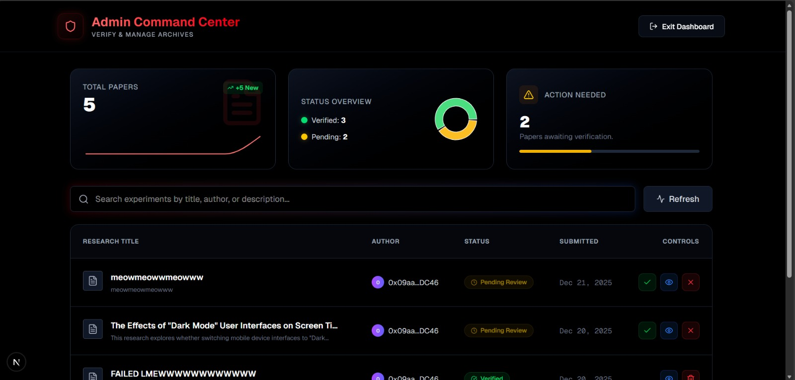

<div align="center">
  <h1>DataCrypt</h1>
  <h3>Turning Scientific Failure into Intellectual Property</h3>
  
  <p>
    <a href="#-the-problem">The Problem</a> •
    <a href="#-the-solution">The Solution</a> •
    <a href="#-tech-stack">Tech Stack</a> •
    <a href="#-getting-started">Getting Started</a>
  </p>
</div>

---

## 📖 Introduction:

**DataCrypt** is a Decentralized Science (DeSci) marketplace designed to solve a major inefficiency in global research: **waste.**

In the scientific world, researchers spend months or years conducting experiments. Often, these experiments do not yield the desired result (e.g., a drug fails to cure a disease). Because scientific journals rarely publish "negative results," this data is discarded.

**The Consequence:** Other scientists, unaware of the failure, repeat the exact same experiments, wasting time, grant money, and resources.

**DataCrypt** creates a standardized way to save, verify, and monetize these "failed" experiments, ensuring that **negative results become positive assets.**

---

## The Solution

DataCrypt allows researchers to mint their negative findings as **IP-NFTs (Intellectual Property Non-Fungible Tokens)**.

1.  **Upload & Encrypt:** A researcher uploads their raw data (logs, datasets). The system encrypts this data so it remains private.
2.  **Proof of Discovery:** We create a digital certificate on the **Polygon Blockchain**. This acts as an immutable timestamp, proving *who* discovered this dead-end and *when*.
3.  **The Marketplace:** Other scientists can browse the marketplace. If they want to see the data to save themselves time, they pay a fee.
4.  **Unlock & Earn:** The data is decrypted for the buyer, and the original researcher gets paid for their "failed" work.

---

## Tech Stack

We utilize a modern web3 stack to ensure security, speed, and user experience.

| Component | Technology | Role in Project |
| :--- | :--- | :--- |
| **Frontend** | **Next.js 14** & Tailwind CSS | Provides a responsive, clean "Glassmorphism" UI for easy navigation. |
| **Blockchain** | **Polygon Amoy Testnet** | Handles the creation of IP-NFTs with low transaction fees and high speed. |
| **Smart Contracts** | **Solidity** & Hardhat | The logic that manages ownership, payments, and data unlocking permissions. |
| **Storage** | **IPFS** & Supabase | **IPFS** ensures decentralized storage; **Supabase** handles metadata and encryption. |
| **Authentication** | **Ethers.js** & MetaMask | Allows users to log in securely using their crypto wallets. |

---

## Project Screenshots

| **Landing Page** | **Publishing Portal** |
|:---:|:---:|
|  |  |

| **Admin Dashboard** |
|:---:|
|  |

---

## Getting Started

Follow these steps to run DataCrypt locally on your machine.

### Prerequisites
* **Node.js** (v18 or higher)
* **MetaMask Wallet** (Browser Extension) configured for the Polygon Amoy Testnet.

### Installation

1.  **Clone the repository**
   ```bash
    git clone https://github.com/cxgx4/DataCryptic.git
    cd DataCryptic
    cd frontend
```

2.  **Install Dependencies**
    ```bash
    npm install


3.  **Run the Development Server**
    ```bash
    npm run dev


4.  **Launch**
    Open [http://localhost:3000](http://localhost:3000) in your browser.

---

## ⛓️ Blockchain Details

* **Network:** Polygon Amoy Testnet
* **Contract Address:** `0x2A5799Cc7E9708b39D14014C143451ABf4938fBd`
* **Explorer:** [View on PolygonScan Amoy](https://amoy.polygonscan.com/address/0x2A5799Cc7E9708b39D14014C143451ABf4938fBd)

---

🤝 Team & Contributions

Built for CodeQuest 2025

| **Cherry Ghosh** | **Debdutta Ghosh** | **Debasmita Chatterjee** |
| :---: | :---: | :---: |
| Developer | Developer | Developer |
| [GitHub](https://github.com/cxgx4) | [GitHub](https://github.com/debdutta1777) | [GitHub](https://github.com/DC-7967) |


---

## 📄 License

Distributed under the MIT License. See `LICENSE` for more information.
